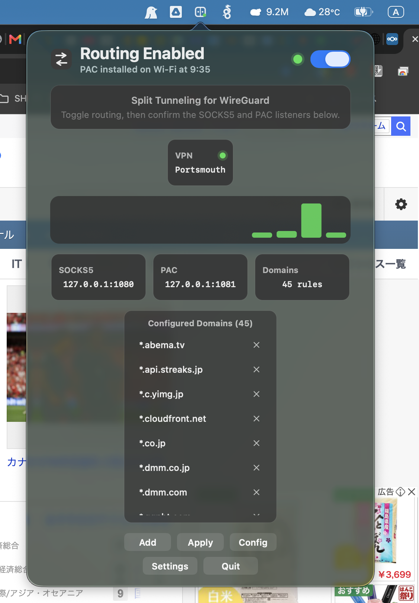
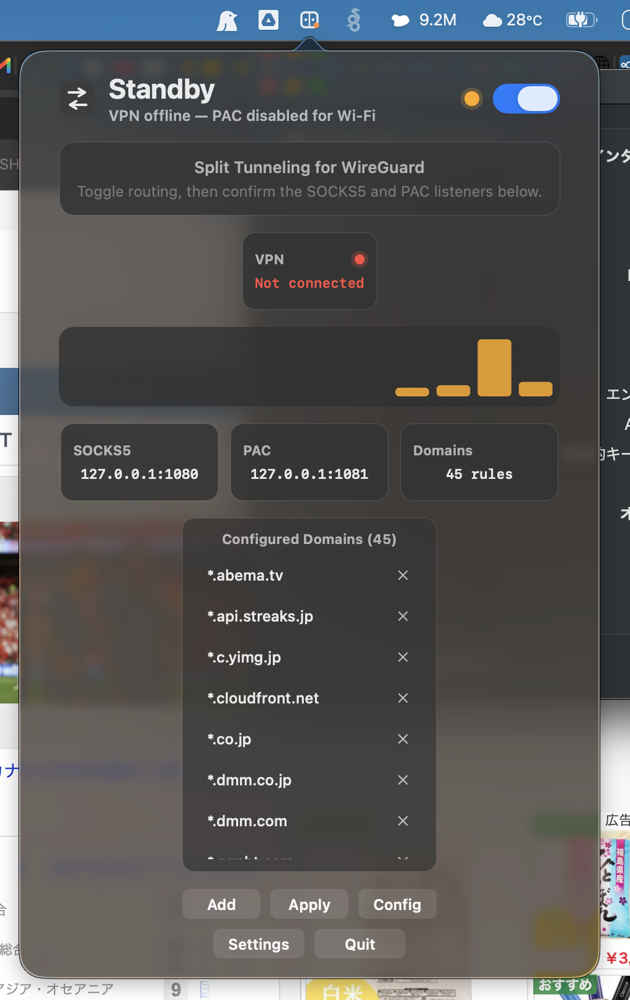

# ProxyBar

ProxyBar is a macOS menu bar app for WireGuard split tunneling. It reads a
crabbyproxy-compatible configuration file, starts local SOCKS5 and PAC servers,
and applies macOS automatic proxy settings to Wi-Fi, LAN, or both only while a
VPN is connected.

Built for WireGuard on macOS, where the Network Extension intercepts all packets before the routing table — making traditional split tunneling unreliable for domain-based exclusions.

<p>
  
  
  
  
  
</p>

The default local endpoints are:

```text
socks5://127.0.0.1:1080
http://127.0.0.1:1081/proxy.pac
```

If `[proxy].socks_port` or `[proxy].pac_port` are set in
`~/.config/crabbyproxy/config.toml`, ProxyBar uses those ports instead.

## Screenshots

| Routing enabled | VPN standby |
| --- | --- |
|  |  |

## Features

- Menu bar controls for starting, stopping, and inspecting local proxy routing.
- Embedded SOCKS5 proxy bound to `127.0.0.1`.
- Embedded PAC HTTP server at `/proxy.pac`.
- Domain rule editor for adding and removing split-tunneled domains.
- Automatic apex plus wildcard domain handling, such as `example.com` and
  `*.example.com`.
- VPN-aware routing: ProxyBar keeps local listeners available, disables the
  system PAC when the VPN is disconnected, and resumes routing when the VPN
  reconnects.
- DNS-over-HTTPS A-record lookup for SOCKS5 domain destinations.
- macOS `networksetup` integration for Wi-Fi and LAN automatic proxy configuration.
- LAN services are detected from current macOS service names, including USB LAN
  adapters and Thunderbolt Ethernet.
- Open-at-login support through `SMAppService`.
- Secure Sparkle updates with daily background checks, automatic downloads,
  install-on-quit behavior, and a manual `Check for Updates…` command.
- Diagnostic logging through macOS unified logging.

## Credits

ProxyBar is base on the idea of **[crabbyproxy](https://github.com/digital-shokunin/crabbyproxy)** .

## How it works

1. Browser PAC file routes target domains to the local SOCKS5 proxy
2. Proxy resolves DNS via DoH — bypasses VPN DNS, gets geo-correct CDN IPs
3. Proxy binds outgoing sockets to the physical interface (`IP_BOUND_IF`)
4. macOS honors the binding even with VPN active — traffic goes direct
5. All other traffic goes through the VPN as normal

## Install

Install ProxyBar with Homebrew:

```sh
brew install --cask baha2046/proxybar/proxybar
```

Or download `ProxyBar-1.0.2.zip` from the
[GitHub Releases](https://github.com/baha2046/ProxyBar/releases) page, unzip it,
and move `ProxyBar.app` to `/Applications`. Homebrew is recommended because the
cask clears the quarantine attribute after installation.

## Requirements

- macOS 13 or later
- Swift 6 toolchain
- A writable `~/.config/crabbyproxy/` directory for persistent custom domains
  and ports
- Permission to run macOS `networksetup` commands for Wi-Fi and LAN proxy settings

## Configuration

ProxyBar reads:

```text
~/.config/crabbyproxy/config.toml
```

If that file does not exist when ProxyBar first needs the editable config, it
creates it with the same defaults shown in `config.sample.toml`.

Example:

```toml
[proxy]
socks_port = 1080
pac_port = 1081
domains = [
    "example.com",
    "*.example.com"
]

[doh]
servers = [
    "https://1.1.1.1/dns-query",
    "https://8.8.8.8/dns-query"
]
```

If the config file is missing or cannot be parsed for runtime settings,
ProxyBar falls back to built-in crabbyproxy-style defaults.

## Build

Run the core behavior tests:

```sh
swift run ProxyBarCoreTests
```

Build the release binary:

```sh
swift build -c release --product ProxyBar
```

Release packaging requires a valid `Developer ID Application` certificate in
your keychain, Apple notarization credentials, and a Sparkle EdDSA signing key.
Store your Apple notarization credentials once under the default profile name:

```sh
xcrun notarytool store-credentials develop
```

Resolve the package once, then generate the Sparkle key pair:

```sh
swift package resolve
.build/artifacts/sparkle/Sparkle/bin/generate_keys
```

`generate_keys` stores the private key in your login Keychain and prints the
public key. Keep the private key in Keychain; never commit or place it in the
app bundle. Export the printed public key before packaging:

```sh
export SPARKLE_PUBLIC_ED_KEY='<public key printed by generate_keys>'
```

Create the signed, notarized, and stapled app bundle and release zip:

```sh
scripts/package-app.sh 1.0.3
```

The script automatically selects the first valid Developer ID Application
identity and submits notarization with the `develop` keychain profile. Set
`SIGNING_IDENTITY` or `NOTARY_PROFILE` to override either default. Set
`BUILD_NUMBER` to override the bundle build number, which defaults to the
release version.

The app bundle, release archive, and EdDSA-signed Sparkle feed are written to:

```text
.build/ProxyBar.app
dist/ProxyBar-1.0.3.zip
dist/appcast.xml
```

Create the GitHub release as a draft tagged `v1.0.3`, upload both files from
`dist`, and then publish the release. The appcast download URL is
`https://github.com/baha2046/ProxyBar/releases/latest/download/appcast.xml`, so
publishing only after both assets are present prevents clients from seeing an
incomplete release.

Swift Package Manager supplies Sparkle's framework and release tools under
`.build/artifacts/sparkle/Sparkle/`. The packaging script embeds and signs the
framework, then runs its `bin/generate_appcast` tool using the private EdDSA key
from Keychain.

## Use

Open `.build/ProxyBar.app`. It appears in the macOS menu bar as `ProxyBar`.

- Turn ProxyBar on to start the local SOCKS5 and PAC listeners.
- Use `Settings` to choose whether ProxyBar applies PAC to Wi-Fi, LAN, or both.
- Connect your VPN to let ProxyBar apply the PAC URL to the selected services.
- Use `Add` to add a domain or URL.
- Use the remove button next to a domain to delete it.
- Use `Apply` to rewrite, reload, and reapply the current domain rules.
- Use `Config` to open `config.toml`.
- Use the `Check for Updates…` button beside the version number in the Settings
  window for an immediate Sparkle update check.
- Turn ProxyBar off or quit the app to disable automatic proxy settings.

ProxyBar is intentionally unsandboxed because it needs to edit your home config
file, bind local loopback ports, inspect VPN state, and run `networksetup`.
Sparkle checks for updates every 24 hours, downloads eligible updates
automatically, and installs them when ProxyBar quits when possible. Sparkle
shows its standard confirmation or authorization UI when user interaction is
required.

## Troubleshooting

ProxyBar writes diagnostic messages to macOS unified logging with subsystem
`ProxyBar`. To watch live logs while reproducing an issue:

```sh
log stream --predicate 'subsystem == "ProxyBar"' --info --debug
```

To inspect recent logs after reopening the app:

```sh
log show --last 10m --predicate 'subsystem == "ProxyBar"' --info --debug
```

If the app quits while loading a busy site, check the latest `socks5` entries
first. They include the SOCKS5 connection ID, destination host and port, DoH
result, relay byte counts, and socket errors such as `Broken pipe`.

## 機能説明

### メニューバー UI

ProxyBar は macOS のメニューバーに常駐します。ポップオーバーからプロキシの
オン/オフ、VPN 状態、SOCKS5/PAC の待ち受けポート、登録済みドメイン数、
ドメイン一覧、エラー状態を確認できます。`Add`、`Apply`、`Config`、`Settings`、
`Quit` の操作をここから実行できます。`Settings` では Wi-Fi/LAN の適用先と
`Open at Login` を切り替えられます。

### ドメイン管理

`~/.config/crabbyproxy/config.toml` の `[proxy].domains` を読み書きします。
`Add` に `example.com` または URL を入力するとホスト名を正規化し、
`example.com` と `*.example.com` の両方を登録します。`localhost` は例外として
完全一致のみで登録されます。削除時も apex と wildcard のペアをまとめて削除し、
保存前に重複排除とソートを行います。設定を書き換えるたびに、同じディレクトリへ
タイムスタンプ付きの `config.toml.*.bak` を作成します。

### PAC 生成と macOS 反映

設定されたドメインから PAC ファイルを生成します。対象ドメインに一致した通信は
`SOCKS5 127.0.0.1:<socks_port>` に送られ、それ以外は `DIRECT` になります。
VPN 接続中は `networksetup` で選択した Wi-Fi/LAN の自動プロキシ URL を
`http://127.0.0.1:<pac_port>/proxy.pac` に設定し、有効化します。停止時または
VPN 切断時は選択した適用先の自動プロキシを無効化します。
LAN は `networksetup -listallnetworkservices` の実際のサービス名から検出し、
USB LAN アダプターや Thunderbolt Ethernet も対象にします。

### SOCKS5 プロキシ

ローカル SOCKS5 サーバーは SOCKS5 CONNECT リクエストを処理し、IPv4 または
ドメイン名の宛先へ TCP リレーします。ドメイン名は設定された DoH サーバーで
A レコードを解決し、短時間キャッシュします。ハンドシェイクにはタイムアウトと
サイズ上限があり、長時間のリレーはハンドシェイク完了後に継続できます。

### VPN 連動

ProxyBar は `scutil --nc list` で VPN 接続状態を監視します。VPN が接続中なら
PAC を有効にして `Routing Enabled` になります。VPN が切断されると PAC を無効化し、
SOCKS5/PAC のローカルサーバーは維持したまま `Standby` になります。VPN が再接続
されると PAC を再適用して自動的にルーティングを再開します。

### 診断ログ

アプリのライフサイクル、PAC 配信、SOCKS5 接続、DoH 解決、リレー結果、エラーは
macOS unified logging に `ProxyBar` サブシステムで記録されます。接続 ID、宛先、
解決結果、転送バイト数、ソケットエラーを確認できます。

## License

ProxyBar is released under the MIT License. See [LICENSE](LICENSE).
